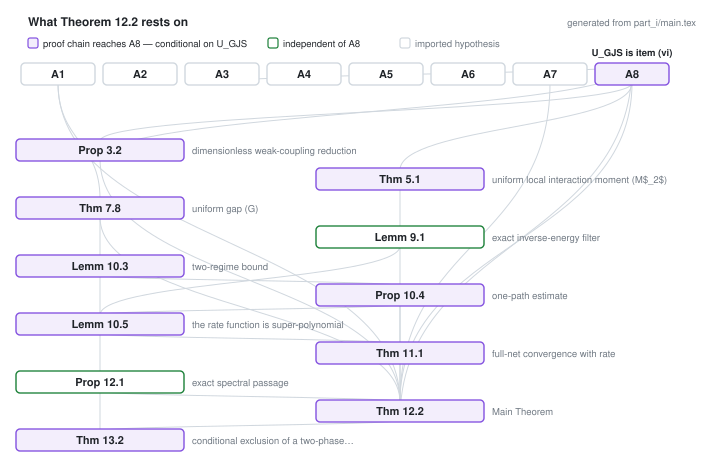
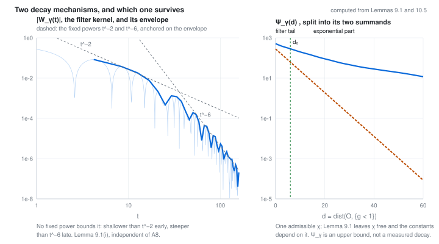
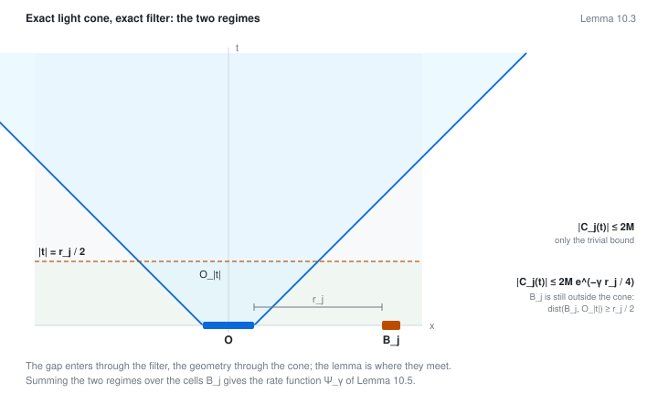
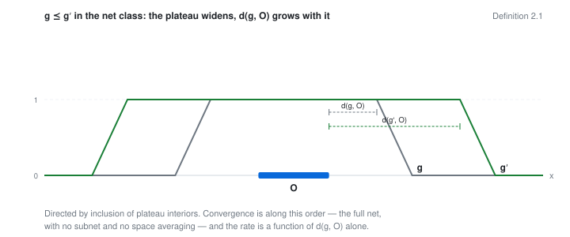
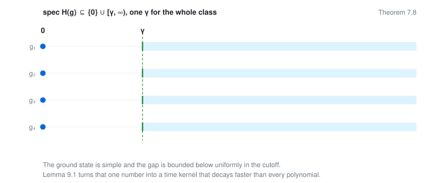

# Removal of the spatial cutoff for weakly coupled P(φ)₂

Manuscript, working notes, and the full adversarial audit trail for a Hamiltonian proof
that the net of spatially cutoff P(φ)₂ ground states converges in norm on every local
algebra. This is a research record, not a published paper.

## What this is: an AI-assisted, experimental open-science project

This repository is an **experiment in open science, and the work in it is AI-assisted.**
The manuscript, the working notes and the audit documents were drafted by the author
working with Anthropic's Claude as an interactive assistant, and the entire working
method — every phase, gate and adversarial round, including the rounds that found errors
in earlier rounds' repairs — is published alongside the result rather than discarded.
That is the experiment: the record of how the proof was arrived at is part of what is
being released.

**Human verification of the output is ongoing.** Nothing here has been refereed, and the
author's own line-by-line check of the machine-assisted material is still in progress:
open audit item C5 (a second human reader for the source page images, see below) is
unclosed, and the main theorem is conditional on an imported hypothesis. Read every
statement in this repository as a claim under active verification, not as a settled
result, and check anything you intend to rely on against the cited sources yourself.
Direction, mathematical judgement and final responsibility are the author's.

## Status: the main theorem is conditional. Please read this first.

**Part I** (`part_i/main.tex`, 40 pp, document of record) proves Theorem 12.2. In the
Glimm–Jaffe–Spencer weak-coupling region 0 ≤ λ/m₀² < ε_P, the full net (ω_g) of cutoff
ground states, with no subnets and no space averaging, converges in norm on every local
algebra A(O),

    lim_{g∈G} ‖(ω_g − ω_∞)|_{A(O)}‖ = 0,

with an explicit super-polynomial rate in dist(O, {g < 1}). The limit is locally normal,
translation invariant, ℤ₂ invariant for even P, and a ground state of the Glimm–Jaffe
dynamics (A, α) in the spectral sense.

The proof is an implication from the imports A1–A8 enumerated in §2. **It is not a proof
of those imports.** One of them is not a literal quotation of a printed theorem:

- **A8(vi), written U_GJS**, is the cutoff-uniform form of the Glimm–Jaffe–Spencer moment
  estimate (Ann. of Math. **100** (1974), Thm. 1.1.8) on the slab family used here. Since
  the scope amendment of 5 September 2026 it is documented as imported at the scope at
  which the source itself states and uses it, with the relevant passages on pp. 594–597
  and 629 quoted verbatim in item A8(vii′), rather than as a quantifier strengthened
  beyond the source. It remains a named hypothesis of Theorem 12.2. This manuscript does
  not re-derive the cluster expansion: Appendix C audits the source mechanism and proves
  two analytic prerequisites only.

**Open audit item C5.** No second human reader has yet checked the source page images
against the transcriptions in §2. The itemized checklist is
`part_i/C5_reading_record.md`; all nine verdict fields are still blank.

**Part II** is open at gate (II.11). Its preparatory scoping pass is
`part_ii/gate_II11_scoping.tex`, and phases V0–V4 are recorded in `strategy.md`. Nothing
in Part I depends on Part II.

The manuscript states its own negative scope in the abstract: no uniqueness of ω_∞ among
all locally normal ground states, no sharp exponential rate, and no claim outside the
weak-coupling region.

## The proof in five pictures

Each figure links to an interactive version. One of them, the rate figure, has its
curves computed from the manuscript's own formulas by
[`docs/figures/make_figures.py`](docs/figures/make_figures.py) rather than drawn, which
makes it a checkable artifact; a second, the import graph, is generated from the
manuscript's own reference graph. The remaining three are drawn to scale from the
statements they illustrate and evaluate nothing. All of them illustrate; none of them is
evidence.

### What Theorem 12.2 rests on

<picture>
  <source media="(prefers-color-scheme: dark)" srcset="docs/figures/imports-dag-dark.svg">
  
</picture>

Generated from `part_i/main.tex`: the nodes are the spine of Part I, the edges are its
own `\ref` graph, and the shading is computed, not asserted. A statement is marked
conditional exactly when its proof chain reaches A8, the GJS package whose item (vi) is
U_GJS. Twenty-four of the sixty-one numbered statements are; the [result
inventory](docs/results.md) lists which. The exact inverse-energy filter is not among
them, which is as it should be — it is operator theory and Fourier analysis.

### Where the rate comes from, and what survives

<picture>
  <source media="(prefers-color-scheme: dark)" srcset="docs/figures/rate-dark.svg">
  
</picture>

Left, the filter kernel and its envelope, computed: shallower than t⁻² early, steeper than
t⁻⁶ late. What Lemma 9.1(i) proves is that the kernel has finite moments of every order, so
its tail falls below every power. Right, Lemma 10.5: the two summands of
the rate function. The exponential part collapses; the filter tail is what remains, and
it is what makes the rate super-polynomial rather than merely exponential-then-stuck.
Both are computed for one admissible χ, which Lemma 9.1 leaves free; the shapes are the
content, not the heights. Ψ_γ is an upper bound, never a measured decay of any state.

### The two regimes

<picture>
  <source media="(prefers-color-scheme: dark)" srcset="docs/figures/light-cone-dark.svg">
  
</picture>

The exact light cone of Proposition 2.7 confines a time-evolved local observable, and
the exact filter converts the gap into a decaying time kernel. While |t| ≤ r_j/2 the
cell B_j is still outside O_|t|, and clustering gives an exponentially small bound; past
that time only the trivial bound survives. Summing the two regimes over cells produces
Ψ_γ. This lemma is where the geometry and the spectrum meet.

### The net, and the gap that does not close

<picture>
  <source media="(prefers-color-scheme: dark)" srcset="docs/figures/plateau-net-dark.svg">
  
</picture>

<picture>
  <source media="(prefers-color-scheme: dark)" srcset="docs/figures/uniform-gap-dark.svg">
  
</picture>

Convergence is along the plateau order — the full net, no subnet, no space averaging —
and the rate is a function of d(g, O) alone. It is available because the gap is bounded
below by one γ for the whole cutoff class.

## Documents

| document | | what it is |
|---|---|---|
| [`part_i/main.pdf`](part_i/main.pdf) | 40 pp | **the document of record.** Theorem 12.2 and its full proof from the imports |
| [`part_ii/gate_II11_scoping.pdf`](part_ii/gate_II11_scoping.pdf) | 11 pp | the open Part II programme at gate (II.11) |
| [`audit_2026/critical_proof_audit.pdf`](audit_2026/critical_proof_audit.pdf) | 10 pp | the independent audit, frozen against the v1 hash |
| [`fresh_audit_2026_08_16/critical_audit_parts_i_ii.pdf`](fresh_audit_2026_08_16/critical_audit_parts_i_ii.pdf) | 11 pp | a second, independent audit of both parts |
| [`fresh_audit_2026_08_16/lamport_reconstruction_parts_i_ii.pdf`](fresh_audit_2026_08_16/lamport_reconstruction_parts_i_ii.pdf) | 114 pp | the whole chain rebuilt in Lamport's hierarchical proof format |
| [`output/pdf/glimm-jaffe-lamport-euclidean-to-gap.pdf`](output/pdf/glimm-jaffe-lamport-euclidean-to-gap.pdf) | 9 pp | fully explicit: GJS ⟹ (M₂) + (G) |
| [`output/pdf/glimm-jaffe-lamport-gap-to-main-theorem.pdf`](output/pdf/glimm-jaffe-lamport-gap-to-main-theorem.pdf) | 10 pp | fully explicit: (M₂) + (G) ⟹ the main theorem |

## Documentation

[`docs/`](docs/) is the navigable index. It is also published as a site:
**<https://alexander-stottmeister.github.io/pphi2-cutoff-removal/>**, where the eight
figures below are interactive.

| | |
|---|---|
| [status](docs/status.md) | what is proved, what is conditional, what is open; the gate record |
| [results](docs/results.md) | all 61 numbered statements with dependencies — generated, never hand-edited |
| [imports](docs/imports.md) | A1–A8, and exactly what U_GJS is and is not |
| [definitions](docs/definitions.md) · [notation](docs/notation.md) | the objects and the frozen symbol table |
| [provenance](docs/provenance.md) | frozen sources, corrections history, the dossiers |

## Layout

| path | what it is |
|---|---|
| `part_i/` | document of record, its `README.md` with gates G0–G6 and step maps, and the C5 reading record |
| `part_ii/` | the open programme, gate (II.11) scoping, phases V0–V4 |
| `m0/`–`m6/` | historical working drafts, superseded by `part_i/main.tex` and kept for provenance |
| `audit_2026/` | citation screenshot dossier and the 2026 critical proof audit |
| `fresh_audit_2026_08_16/` | independent audit, Lamport-style reconstruction, evidence ledgers |
| `repair_2026_08_16/` | post-repair checks and artifact hashes |
| `output/pdf/` | compiled snapshots of the documents above |
| `strategy.md` | the living plan and chronological record of every phase and gate |
| `docs/` | the navigable documentation and the figure site; `docs/extract.py` regenerates the inventory |
| `.githooks/` | the publication-boundary guard and its self-test |

## What is deliberately not in this repository

Source PDFs (`refs/`) and every page image used as citation evidence (`**/evidence/`,
`part_ii/dossier_images/`) are third-party copyrighted material and are not
redistributed here. Two consequences:

- The dossier sources still build. Missing page images are replaced by framed
  placeholders, and every claim, page reference, and finding remains in the text.
- `fresh_audit_2026_08_16/render_evidence.sh` regenerates the audit's page-image corpus
  from your own copies of the sources. Each call is pinned to a one-based page number, so
  the images are reproducible for anyone with legal access to the papers. The script
  names the file it expects for each source, under `refs/`; those names are the script's
  own contract, and the simplest way to satisfy it is to read the `render` lines and put
  your PDFs where they point.

Short quotations from the sources appear in the manuscript with page citations, as usual
in scholarly work, and each transcribed display carries a `% src:` comment naming its
origin.

The boundary is enforced mechanically rather than by care alone. `.gitignore` excludes
the source and image paths, every raster image extension and every archive format.
`.githooks/pre-commit` then refuses any commit that stages one regardless, and judges
each staged file by its bytes as well as its name: a page image under a new or false
name, a PDF that embeds a raster image, a PDF or PostScript file under another name, and
a figure carrying a raster inside it as a data URI are refused as well. Enable the hook
in a fresh clone, and test both files as they stand in the working tree, with

```sh
git config core.hooksPath .githooks
sh .githooks/selftest.sh
```

## Building

Part I has no external dependencies, no BibTeX and no graphics; three passes resolve
all references.

```sh
cd part_i && pdflatex main.tex && pdflatex main.tex && pdflatex main.tex
```

A clean build is 40 pages with zero errors and zero undefined references.

The three citation dossiers (`audit_2026/`, `fresh_audit_2026_08_16/`, `part_ii/`) build
the same way, from their own directory. Without the page-image corpus each image is
replaced by a framed placeholder naming the missing file, and the build still completes
with zero errors.

The printed date is pinned in the preamble to the last mathematical change, so it does
not drift between builds. The PDF bytes would otherwise still carry pdftex's own build
timestamp, so the committed `part_i/main.pdf` is built with that timestamp pinned too:

```sh
SOURCE_DATE_EPOCH=1788566400 FORCE_SOURCE_DATE=1 pdflatex main.tex   # x3
```

Three passes of this command reproduce the committed PDF byte for byte under pdfTeX
1.40.29 (TeX Live 2026).

## License

Manuscript, notes, and all prose: [CC BY 4.0](LICENSE).
Code -- scripts (`*.py`, `*.sh`), the LaTeX style files, and the documentation site
under `docs/` (`*.js`, `*.html`, `*.css`, `*.svg`): [MIT](LICENSE-CODE).
Quoted third-party material remains under its own copyright and is used as citation.

## How this record was produced

As stated at the top, this is an AI-assisted research record. Concretely, the assistant
drafted and transcribed source passages, recomputed constants by hand and by machine, ran
the adversarial verification passes recorded in `strategy.md`, and maintained the citation
dossiers. Direction, mathematical judgement and final responsibility are the author's.
Commits where the assistant contributed carry a `Co-Authored-By` trailer, so the git
history shows the division of labour.

Because the output is machine-assisted, the verification standard applied to it is higher
than usual, not lower: every imported statement is pinned to a page of a source, the
dossiers reproduce those pages, and `part_i/README.md` records which gate each section
passed. That verification is still running — see the note at the top of this file.

The working method is itself part of the record. `strategy.md` logs every phase, gate
and adversarial round, including the rounds that found errors in earlier rounds' repairs,
and `part_i/README.md` maps each section of the manuscript back to the working draft it
came from.

## Citing

See `CITATION.cff`. If you cite the theorem, please cite it as conditional on U_GJS.
